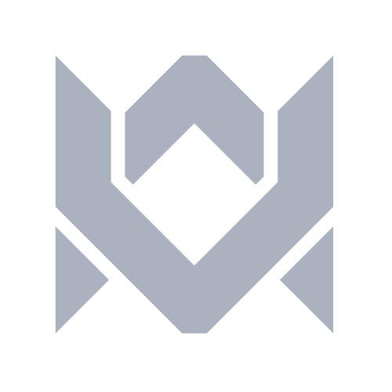
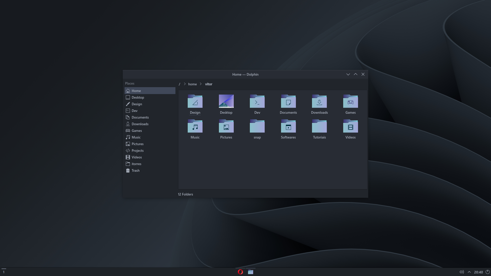

  

## Configuration

<table>
  <tr>
    <th align="left" width="180">OS</th>
    <td width="360"><a href="https://manjaro.org/downloads/official/kde">Manjaro</a></td>
  </tr>
  <tr>
    <th align="left">DE</th>
    <td><a href="https://kde.org/pt-br/plasma-desktop">Plasma</a></td>
  </tr>
  <tr>
    <th align="left">Terminal</th>
    <td><a href="https://sw.kovidgoyal.net/kitty">Kitty</a></td>
  </tr>
  <tr>
    <th align="left">Shell</th>
    <td><a href="https://fishshell.com">Fish</a> + <a href="https://starship.rs">Starship</a></td>
  </tr>
  <tr>
    <th align="left">Terminal Font</th>
    <td><a href="https://github.com/IBM/plex">BlexMono Nerd Font Medium 11</a></td>
  </tr>
  <tr>
    <th align="left">System Font</th>
    <td><a href="https://docs.microsoft.com/pt-br/typography/font-list/segoe-ui">Segoe UI Semibold 10</a></td>
  </tr>
  <tr>
    <th align="left">Panel</th>
    <td><a href="https://userbase.kde.org/Plasma/Panels">Plasma Panel 28</a></td>
  </tr>
  <tr>
    <th align="left">Panel Widgets</th>
    <td><a href="https://github.com/wsdfhjxc/virtual-desktop-bar">Virtual Desktop Bar</a></td>
  </tr>
  <tr>
    <th align="left">TWM</th>
    <td><a href="https://github.com/Bismuth-Forge/bismuth">Bismuth</a></td>
  </tr>
</table>

## Plasma Appearance

<table>
  <tr>
    <th align="left" width="180">Application Style</th>
    <td width="360"><a href="https://github.com/Luwx/Lightly">Lightly</a></td>
  </tr>
  <tr>
    <th align="left">Plasma Style</th>
    <td><a href="https://archlinux.org/packages/extra/x86_64/breeze">Breeze</a></td>
  </tr>
  <tr>
    <th align="left">Colors</th>
    <td><a href="config/kde/kde.colors">OneDarkV</a></td>
  </tr>
  <tr>
    <th align="left">Window Decorations</th>
    <td><a href="https://github.com/Bismuth-Forge/bismuth">Bismuth</a></td>
  </tr>
  <tr>
    <th align="left">Icons</th>
    <td><a href="https://store.kde.org/p/1373825">Sensual-Breeze-Dark Icons</a></td>
  </tr>
  <tr>
    <th align="left">Cursors</th>
    <td><a href="https://store.kde.org/p/1381208">We10XOS Cursors</a></td>
  </tr>
  <tr>
    <th align="left">Lauch Feedback</th>
    <td>Cursor Static</td>
  </tr>
  <tr>
    <th align="left">Fonts Management</th>
    <td><a href="https://docs.microsoft.com/pt-br/typography/font-list/segoe-ui">Segoe UI Semibold 10</a></td>
  </tr>
  <tr>
    <th align="left">Splash Screen</th>
    <td><a href="config/kde/splash-screen/onedarkv">QuarksSplashDark Custom</a></td>
  </tr>
</table>

## Desktop Apps

<table>
  <tr>
    <th align="left" width="180">File Manager</th>
    <td width="360"><a href="https://apps.kde.org/dolphin">Dolphin</a></td>
  </tr>
  <tr>
    <th align="left">File Syncronizer</th>
    <td>
      <a href="https://freefilesync.org">FreeFileSync</a>,
      <a href="https://krusader.org">Krusader</a>
    </td>
  </tr>
  <tr>
    <th align="left">Editor</th>
    <td><a href="https://code.visualstudio.com">VS Code</a></td>
  </tr>
  <tr>
    <th align="left">Browser</th>
    <td>
      <a href="https://vivaldi.com/pt-br">Vivaldi</a>,
      <a href="https://www.mozilla.org">Firefox</a>
    </td>
  </tr>
  <tr>
    <th align="left">Browser Plugins</th>
    <td>
      <a href="https://chrome.google.com/webstore/detail/ublock-origin/cjpalhdlnbpafiamejdnhcphjbkeiagm">uBlockOrigin</a>,
      <a href="https://chrome.google.com/webstore/detail/blending-scrollbar/ajjnokaolfbjimgelmdmdlijoclmjnag">Blending Scrollbar</a> 
      <a href="https://github.com/zombieFox/nightTab">nightTAb</a>,
      <a href="https://github.com/itsecurityco/to-google-translate">To Google Translate</a>
    </td>
  </tr>
  <tr>
    <th align="left">Video Player</th>
    <td><a href="https://www.videolan.org/vlc">VLC</a></td>
  </tr>
  <tr>
    <th align="left">Screenshot</th>
    <td><a href="https://flameshot.org">Flameshot</a></td>
  </tr>
  <tr>
    <th align="left">Color Picker</th>
    <td><a href="https://apps.kde.org/kcolorchooser">KColorChooser</a></td>
  </tr>
  <tr>
    <th align="left">Torrent</th>
    <td><a href="https://www.qbittorrent.org">qBitTorrent</a></td>
  </tr>
  <tr>
    <th align="left">Password Manager</th>
    <td><a href="https://bitwarden.com">Bitwarden</a></td>
  </tr>
  <tr>
    <th align="left">Batch Rename</th>
    <td><a href="https://apps.kde.org/krename">KRename</a></td>
  </tr>
  <tr>
    <th align="left">Subtitle</th>
    <td><a href="https://subtitlecomposer.kde.org">Subtitle Composer</a></td>
  </tr>
</table>

## Terminal Apps

<table>
  <tr>
    <th align="left" width="180">File Manager</th>
    <td width="360"><a href="https://vifm.info">vifm</a></td>
  </tr>
  <tr>
    <th align="left">File Syncronizer</th>
    <td><a href="https://github.com/WayneD/rsync">rsync</a></dd>
  </tr>
  <tr>
    <th align="left">Editor</th>
    <td><a href="https://neovim.io">neovim</a></td>
  </tr>
  <tr>
    <th align="left">Music Player</th>
    <td><a href="https://cmus.github.io">cmus</a></td>
  </tr>
  <tr>
    <th align="left">Video Player</th>
    <td><a href="https://mpv.io">mpv</a></td>
  </tr>
</table>

## Colors

### Terminal

<table>
  <thead>
    <tr>
      <th></th>
      <th>Name</th>
      <th>Hex</th>
    </tr>
  </thead>
  <tbody>
    <tr>
      <td></td>
      <td>Black</td>
      <td>#23272e</td>
    </tr>
    <tr>
      <td></td>
      <td>Red</td>
      <td>#e06c75</td>
    </tr>
    <tr>
      <td></td>
      <td>Green</td>
      <td>#98c379</td>
    </tr>
    <tr>
      <td></td>
      <td>Yellow</td>
      <td>#e5c07b</td>
    </tr>
    <tr>
      <td></td>
      <td>Blue</td>
      <td>#61afef</td>
    </tr>
    <tr>
      <td></td>
      <td>Magenta</td>
      <td>#c678dd</td>
    </tr>
    <tr>
      <td></td>
      <td>Cyan</td>
      <td>#56b6c2</td>
    </tr>
    <tr>
      <td></td>
      <td>White</td>
      <td>#abb2bf</td>
    </tr>
  <tbody>
</table>

### Editor

<table>
  <tr>
    <th align="left" colspan="4">Shade</th>
    <th align="left" colspan="4">Color</th>
  </tr>
  <tr>
    <th align="left"></th>
    <th align="left">Name</th>
    <th align="left">Hex</th>
    <th align="left" width="180">Use</th>
    <th align="left"></th>
    <th align="left">Name</th>
    <th align="left">Hex</th>
    <th align="left" width="180">Use</th>
  </tr>
  <tr>
    <td></td>
    <td>shade0</td>
    <td>#23272e</td>
    <td>background color</td>
    <td></td>
    <td>accent0</td>
    <td>#e06c75</td>
    <td>red</td>
  </tr>
  <tr>
    <td></td>
    <td>shade1</td>
    <td>#1e2227</td>
    <td>ui, darker</td>
    <td></td>
    <td>accent1</td>
    <td>#d19a66</td>
    <td>orange</td>
  </tr>
  <tr>
    <td>shade2"></td>
    <td>shade2</td>
    <td>#3d4556</td>
    <td>ui, text selection</td>
    <td></td>
    <td>accent2</td>
    <td>#e5c07b</td>
    <td>yellow</td>
  </tr>
  <tr>
    <td>shade3"></td>
    <td>shade3</td>
    <td>#5c6370</td>
    <td>ui, code comments</td>
    <td></td>
    <td>accent3</td>
    <td>#98c379</td>
    <td>green</td>
  </tr>
  <tr>
    <td>shade4"></td>
    <td>shade4</td>
    <td>#2c313c</td>
    <td>ui, line highlight</td>
    <td></td>
    <td>accent4</td>
    <td>#56b6c2</td>
    <td>cyan</td>
  </tr>
  <tr>
    <td>shade5"></td>
    <td>shade5</td>
    <td>#828997</td>
    <td>ui</td>
    <td></td>
    <td>accent5</td>
    <td>#61afef</td>
    <td>blue</td>
  </tr>
  <tr>
    <td></td>
    <td>shade6</td>
    <td>#979eab</td>
    <td>foreground text</td>
    <td></td>
    <td>accent6</td>
    <td>#c678dd</td>
    <td>purple</td>
  </tr>
  <tr>
    <td></td>
    <td>shade7</td>
    <td>#abb2bf</td>
    <td>foreground text</td>
    <td></td>
    <td>accent7</td>
    <td>#be5046</td>
    <td>magenta</td>
  </tr>
</table>

### Color Inspirations:
- [OneDarkPro](https://github.com/Binaryify/OneDark-Pro)
- [Base16](https://github.com/LalitMaganti/base16-onedark-scheme)
- [Themer](https://themer.dev/?colors.dark.accent0=%23e06c75&colors.dark.accent1=%23d19a66&colors.dark.accent2=%23e5c07b&colors.dark.accent3=%2398c379&colors.dark.accent4=%2356b6c2&colors.dark.accent5=%2361afef&colors.dark.accent6=%23c678dd&colors.dark.accent7=%23be5046&colors.dark.shade0=%23282c34&colors.dark.shade1=%23393e48&colors.dark.shade2=%234b515c&colors.dark.shade3=%235c6370&colors.dark.shade4=%23636d83&colors.dark.shade5=%23828997&colors.dark.shade6=%23979eab&colors.dark.shade7=%23abb2bf&colors.light.accent0=%23e45649&colors.light.accent1=%23986801&colors.light.accent2=%23c18401&colors.light.accent3=%2350a14f&colors.light.accent4=%230184bc&colors.light.accent5=%234078f2&colors.light.accent6=%23a626a4&colors.light.accent7=%23ca1243&colors.light.shade0=%23fafafa&colors.light.shade1=%23CDCED1&colors.light.shade2=%23a0a1a7&colors.light.shade3=%239d9d9f&colors.light.shade4=%2383858B&colors.light.shade5=%23696c77&colors.light.shade6=%2351535D&colors.light.shade7=%23383a42&activeColorSet=dark&calculateIntermediaryShades.dark=false&calculateIntermediaryShades.light=false)
- [OneDarkV](https://themer.dev/?colors.dark.accent0=%23e06c75&colors.dark.accent1=%23d19a66&colors.dark.accent2=%23e5c07b&colors.dark.accent3=%2398c379&colors.dark.accent4=%2356b6c2&colors.dark.accent5=%2361afef&colors.dark.accent6=%23c678dd&colors.dark.accent7=%23be5046&colors.dark.shade0=%23282c34&colors.dark.shade1=%231e2227&colors.dark.shade2=%233d4556&colors.dark.shade3=%235c6370&colors.dark.shade4=%232c313c&colors.dark.shade5=%23828997&colors.dark.shade6=%23979eab&colors.dark.shade7=%23abb2bf&colors.light.accent0=%23e45649&colors.light.accent1=%23986801&colors.light.accent2=%23c18401&colors.light.accent3=%2350a14f&colors.light.accent4=%230184bc&colors.light.accent5=%234078f2&colors.light.accent6=%23a626a4&colors.light.accent7=%23ca1243&colors.light.shade0=%23fafafa&colors.light.shade1=%23CDCED1&colors.light.shade2=%23a0a1a7&colors.light.shade3=%239d9d9f&colors.light.shade4=%2383858B&colors.light.shade5=%23696c77&colors.light.shade6=%2351535D&colors.light.shade7=%23383a42&activeColorSet=dark&calculateIntermediaryShades.dark=false&calculateIntermediaryShades.light=false)

## Screenshots

  
Click to expand

  

